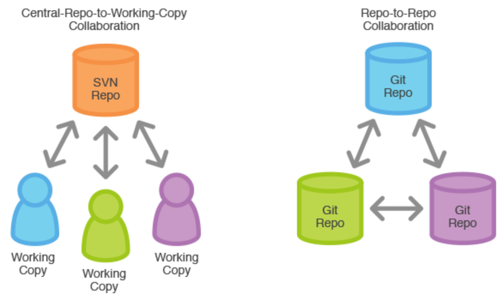
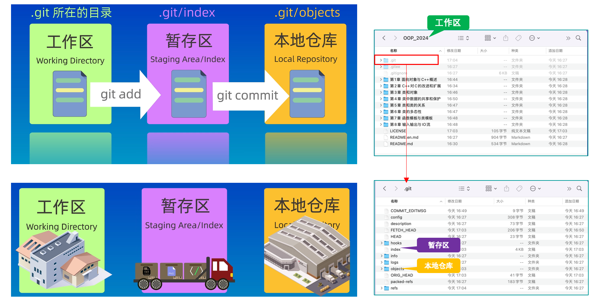
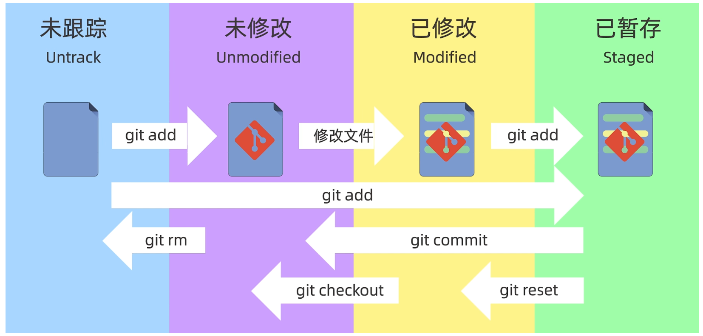
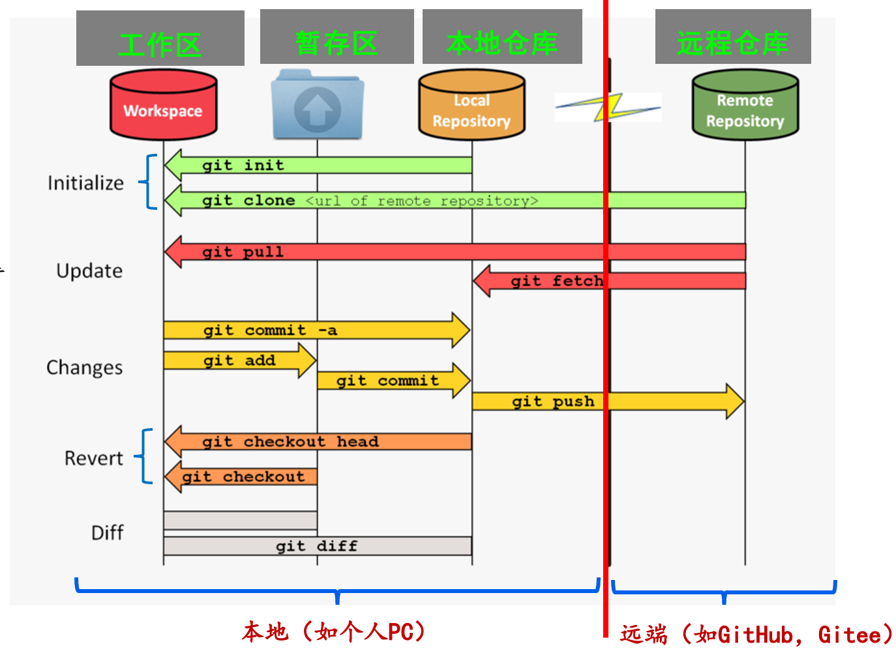

## Git-Learn
---

### git简介
 `Git（读音为/gɪt/）`是一个开源的分布式版本控制系统，可以有效、高速地处理从很小到非常大的项目版本管理。 
Git也是Linus Torvalds为了帮助管理Linux内核开发而开发的一个开放源码的版本控制软件。
Torvalds 开始着手开发 Git 是为了作为一种过渡方案来替代 BitKeeper。Git本意为分支的含义，那么在git里什么是分支呢？下面举例说明：

```
假如现在手头上有一个项目的初始化版本，我们在这个版本的基础上新建分支A、分支B。这个时候，分支A和分支B的内容是一样的。这时，我们在分支A下进行修改、提交，分支A迭代了一个版本。这些操作仅仅会影响分支A，而影响不了分支B。因而，每条分支相当于一条独立的版本控制的路。那么，两条分支之间如何进行交流呢？

git是通过合并分支来实现分支之间的交流的。 假设分支A修改了文件1，分支2修改了文件2，这时，我们将分支A合并到分支B上，那么分支B里的文件1会变成分支A修改过的样子。这就是最简单的分支合并。

Git 处理分支的方式可谓是难以置信的轻量，创建新分支这一操作几乎能在瞬间完成，并且在不同分支之间的切换操作也是一样便捷。

在项目实践中，我们通常会有下面的分支：

- Master 主分支：稳定的产品线
- Develop 开发分支：测试环境分支
- Feature 特性分支：相关的子功能模块分支develop 开发分支
- Hotfix 修复 分支：修复相关的Bug分支，用于紧急处理

```


### 版本控制
---

版本控制的目的是实现开发团队并行开发、提高开发效率的基础。其目的在于对软件开发进程中文件或目录的发展过程提供有效的追踪手段，保证在需要时可回到旧的版本，避免文件的丢失、修改的丢失和相互覆盖，通过对版本库的访问控制避免未经授权的访问和修改，达到有效保护企业软件资产和知识产权的目的。

版本控制的功能在于跟踪记录整个软件的开发过程，包括软件本身和相关文档，以便对不同阶段的软件及相关文档进行表示并进行差别分析，对软件代码进行可撤消的修改，便于汇总不同开发人员所做的修改，辅助协调和管理软件开发团队。

- 集中式版本控制：集中存放所有资料，所有变动都更新到中央服务器。同时所有相关人员想要进行相关浏览和修改都需要连接中央服务器。

- 分布式版本控制：分布式存放所有资料，客户端并不只提取最新版本的文件快照，而是把原始的代码仓库完整地镜像下来。所以每个人都可以独立进行改动资料，并且所有的改动都是在完整资料信息的环境下进行的。



### git基本概念
---



- 工作区（workspace）： 

- 暂存区（staged）：

- 本地仓库（repository）：

### git 文件的四种状态
---
文件跟踪：已跟踪的文件是指那些被纳入了版本控制的文件，在上一次快照中有它们的记录，在工作一段时间后，它们的状态可能处于未修改，已修改或已放入暂存区。工作目录中除已跟踪文件以外的所有其它文件都属于未跟踪文件，它们既不存在于上次快照的记录中，也没有放入暂存区。


### git常用命令
---


